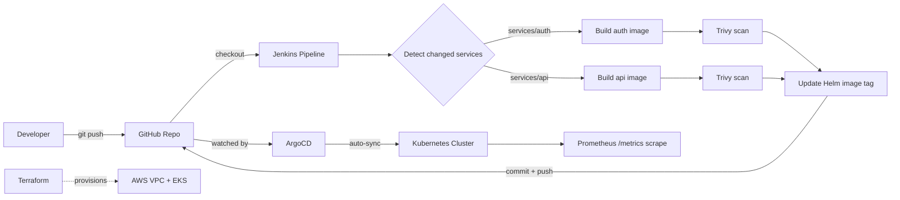

# SaaS Platform: Multi-Tenant DevOps Infrastructure

A hands-on DevOps project that builds the **platform layer** a SaaS product runs on: containerised microservices, a CI/CD pipeline with a security gate, GitOps deployment, Infrastructure as Code, and metrics instrumentation. The applications are deliberately small. The infrastructure around them is the point.

**Author:** Aditya Kapadne ([@Adityakapadne08](https://github.com/Adityakapadne08))

---

## Table of Contents

1. [Project Goals](#project-goals)
2. [Architecture](#architecture)
3. [Tech Stack](#tech-stack)
4. [Repository Structure](#repository-structure)
5. [What Was Built](#what-was-built)
6. [Running It Locally](#running-it-locally)
7. [CI/CD Pipeline in Detail](#cicd-pipeline-in-detail)
8. [Security Measures](#security-measures)
9. [Observability](#observability)
10. [Terraform (AWS EKS)](#terraform-aws-eks)
11. [Key Design Decisions](#key-design-decisions)
12. [Problems Hit and How They Were Fixed](#problems-hit-and-how-they-were-fixed)
13. [Known Limitations and Roadmap](#known-limitations-and-roadmap)

---

## Project Goals

- Build two real microservices, not a copied tutorial app, so the infrastructure has something meaningful to deploy.
- Package them securely (multi-stage builds, non-root users, health checks).
- Automate build, scan, and deploy with Jenkins and ArgoCD, so that a `git push` is the only manual step.
- Define AWS infrastructure (VPC, EKS, per-tenant isolation) as reusable Terraform modules.
- Expose application metrics for Prometheus.

---

## Architecture



**Flow in one sentence:** a push to `services/*` triggers Jenkins, which builds only the changed service, scans the image with Trivy, writes the new image tag into the Helm values, and pushes that change back to Git. ArgoCD sees the Git change and syncs the cluster.

Jenkins never talks to Kubernetes directly. Git is the single source of truth for what runs in the cluster.

---

## Tech Stack

| Layer | Tool | Purpose |
|---|---|---|
| Services | Python 3, FastAPI, Uvicorn | Auth and API microservices |
| Auth | python-jose (JWT), passlib + bcrypt | Token issuing, verification, password hashing |
| Containers | Docker (multi-stage), Docker Compose | Packaging and local orchestration |
| Orchestration | Kubernetes (Docker Desktop cluster) | Running workloads |
| Packaging | Helm 4 | Templated Kubernetes manifests |
| CI | Jenkins (declarative pipeline, run in Docker) | Build, scan, update, commit-back |
| Security scan | Trivy | Image vulnerability scanning |
| CD / GitOps | ArgoCD | Pull-based deployment from Git |
| IaC | Terraform, AWS provider | VPC, EKS, tenant namespaces |
| Remote state | S3 + DynamoDB lock table | Terraform state storage and locking |
| Monitoring | kube-prometheus-stack (Prometheus, Grafana, Alertmanager), prometheus-fastapi-instrumentator | Metrics endpoints and monitoring stack |
| VCS | Git, GitHub, Conventional Commits | Source control |

---

## Repository Structure

```
saas-platform/
├── services/
│   ├── auth/                  # Auth microservice (register, login, verify)
│   │   ├── main.py
│   │   ├── requirements.txt
│   │   └── Dockerfile
│   └── api/                   # Resource API (validates JWT, tenant-scoped)
│       ├── main.py
│       ├── requirements.txt
│       └── Dockerfile
├── helm/
│   ├── auth/                  # Helm chart for auth
│   └── api/                   # Helm chart for api
├── k8s/
│   └── base/
│       ├── argocd-auth-app.yaml   # ArgoCD Application for auth
│       └── argocd-api-app.yaml    # ArgoCD Application for api
├── terraform/
│   ├── modules/
│   │   ├── eks-cluster/       # VPC + EKS cluster
│   │   └── tenant/            # Namespace + quota + NetworkPolicy per tenant
│   └── envs/
│       └── staging/           # Wires modules together
├── jenkins/
│   └── Jenkinsfile            # CI pipeline
├── docs/
├── docker-compose.yml         # Local two-service stack
└── .gitignore
```

Some folders (`monitoring/`, `terraform/modules/monitoring/`, `terraform/envs/prod/`, `k8s/tenants/`) exist as placeholders and are not yet populated. See [Known Limitations](#known-limitations-and-roadmap).

---

## What Was Built

### 1. Microservices

**Auth service** (port `8001`)

| Method | Endpoint | Purpose |
|---|---|---|
| GET | `/health` | Liveness and readiness target |
| POST | `/register` | Create a user (password hashed with bcrypt) |
| POST | `/login` | Verify credentials, return a JWT (30 minute expiry) |
| GET | `/verify` | Validate a bearer token |
| GET | `/metrics` | Prometheus metrics |

**API service** (port `8002`)

| Method | Endpoint | Purpose |
|---|---|---|
| GET | `/health` | Health check |
| POST | `/resources?tenant=...` | Create a resource under a tenant (JWT required) |
| GET | `/resources?tenant=...` | List a tenant's resources (JWT required) |
| DELETE | `/resources/{id}` | Delete a resource; only its owner can (403 otherwise) |
| GET | `/metrics` | Prometheus metrics |

Tested end to end: register and login on auth, then use the issued token against the API service, both locally and inside Docker Compose.

### 2. Docker

- **Multi-stage builds**: dependencies install in a builder stage; only site-packages and the app code are copied into the final image. The final image content size was about **62 MB**, versus 400 MB+ for a naive single-stage Python image.
- **Non-root user**: containers run as `appuser`, not root.
- **HEALTHCHECK** on `/health`, which Docker and Compose use to report `healthy`.
- **Layer caching by design**: `requirements.txt` is copied and installed before app code. Measured result: first build about 48 s, unchanged rebuild about 2.4 s.
- Base image patched with `apt-get upgrade`, and `pip`/`setuptools`/`wheel` upgraded during build.

### 3. Docker Compose

- Both services on a shared bridge network.
- `depends_on` with `condition: service_healthy`, so the API only starts after auth passes its health check.
- `restart: unless-stopped` on both.

### 4. Kubernetes and Helm

Two Helm charts (`helm/auth`, `helm/api`) with templates for Deployment, Service, ServiceAccount, and Ingress, plus shared helpers and `NOTES.txt`.

- **Values-driven config**: image, tag, replicas, ports, probes, resource limits, namespace, and tenant all come from `values.yaml`.
- **Standard labels plus a custom `tenant` label** on every resource, so resources can be queried and selected per tenant.
- **Pod security context**: `runAsNonRoot`, `runAsUser: 1000`.
- **Container security context**: `allowPrivilegeEscalation: false`, `readOnlyRootFilesystem: true`, all Linux capabilities dropped.
- **Liveness and readiness probes** against `/health`.
- **Resource requests and limits** per pod.
- **Dedicated ServiceAccount** per service (conditional via `serviceAccount.create`).
- **Prometheus scrape annotations** on the pod template.
- Verified with `helm template` before every deploy and tested by port-forwarding to the running pod.

### 5. Jenkins CI Pipeline

Jenkins runs as a Docker container with the host Docker socket mounted. The `Jenkinsfile` is loaded from the repo via "Pipeline script from SCM". See [CI/CD Pipeline in Detail](#cicd-pipeline-in-detail).

### 6. ArgoCD GitOps

- ArgoCD installed into the cluster (`argocd` namespace).
- Two `Application` manifests (`k8s/base/`) point at `helm/auth` and `helm/api` on the `main` branch.
- Sync policy: **automated**, with **prune** (delete what is removed from Git) and **selfHeal** (revert manual cluster edits).
- The Application definitions are themselves committed as code.
- Verified end to end: a Jenkins run updated the image tag in Git, ArgoCD synced it, and the new pod ran the new image (`saas-auth:39`, `saas-api:26`).

### 7. Terraform

Modular AWS infrastructure. See [Terraform (AWS EKS)](#terraform-aws-eks).

### 8. Metrics

Both services expose `/metrics` through `prometheus-fastapi-instrumentator` (request counts, latency histograms, status codes). `kube-prometheus-stack` is installed in the `monitoring` namespace. See [Observability](#observability).

---

## Running It Locally

**Prerequisites:** Docker Desktop (with Kubernetes enabled), Python 3, Git, kubectl, Helm.

### Option A: Run a service directly

```powershell
python -m venv venv
venv\Scripts\Activate.ps1
pip install -r services\auth\requirements.txt
uvicorn services.auth.main:app --reload --port 8001
```

Interactive docs are at `http://localhost:8001/docs`.

### Option B: Docker Compose

```powershell
docker build -t saas-auth:v1 services\auth
docker build -t saas-api:v1 services\api
docker compose up -d
docker ps            # both containers should show (healthy)
```

- Auth: `http://localhost:8001/docs`
- API: `http://localhost:8002/docs`

### Option C: Kubernetes with Helm

```powershell
helm template auth-local ./helm/auth     # inspect rendered manifests
helm install auth-local ./helm/auth
kubectl get all -n default
kubectl port-forward svc/auth-local 8001:8001 -n default
```

### Option D: GitOps with ArgoCD

```powershell
kubectl create namespace argocd
kubectl apply -n argocd -f https://raw.githubusercontent.com/argoproj/argo-cd/stable/manifests/install.yaml
kubectl apply -f k8s\base\argocd-auth-app.yaml
kubectl apply -f k8s\base\argocd-api-app.yaml
kubectl get applications -n argocd
```

### Jenkins

```powershell
docker run -d --name jenkins -p 8080:8080 -p 50000:50000 `
  -v jenkins_home:/var/jenkins_home `
  -v //var/run/docker.sock:/var/run/docker.sock `
  jenkins/jenkins:lts
```

The container also needs the Docker CLI installed. On this local setup, socket permissions were relaxed with `chmod 666 /var/run/docker.sock`, which is acceptable for a laptop lab and not for production.

Create a Pipeline job using "Pipeline script from SCM", pointing at this repo, branch `*/main`, script path `jenkins/Jenkinsfile`, with a GitHub credential (`github-creds-2`).

---

## CI/CD Pipeline in Detail

| Stage | What it does |
|---|---|
| **Checkout** | Clones the repo at the triggering commit |
| **Detect Changes** | Diffs against the `last-built-sha` Git tag to see which of `services/auth` and `services/api` changed, and sets `BUILD_AUTH` / `BUILD_API` flags |
| **Build Auth / API Image** | Runs only for changed services; tags the image with the Jenkins build number and `latest` |
| **Scan Auth / API Image** | Trivy scans the built image; the stage fails on unfixed-excluded `CRITICAL` findings |
| **Update Helm Values** | `sed` replaces `tag:` in `helm/<service>/values.yaml` with the build number |
| **Commit & Push** | Resets to `origin/main`, commits the tag change as `ci: update image tags to build N`, and pushes using credentials injected by `withCredentials` |
| **Post** | On success, force-updates the `last-built-sha` tag so the next run diffs from the last built commit |

**Why selective builds matter:** in a monorepo with N services, rebuilding everything on every push wastes time. Only changed services build, scan, and redeploy.

---

## Security Measures

| Area | Measure |
|---|---|
| Passwords | bcrypt hashing via passlib |
| Auth | Short-lived JWT (30 minutes), verified by the API service |
| Images | Multi-stage builds, minimal `python:3.11-slim` base, no build tooling in the final image |
| Runtime | Non-root user in Docker **and** enforced in Kubernetes (`runAsNonRoot`) |
| Kubernetes | Read-only root filesystem, no privilege escalation, all capabilities dropped |
| Resource abuse | CPU/memory requests and limits on every pod |
| Supply chain | Trivy scan in CI blocks images with fixable CRITICAL vulnerabilities |
| Dependencies | Vulnerable transitive packages were found and pinned (for example `starlette` to `1.3.1`) |
| Secrets in CI | GitHub token stored as a Jenkins credential, masked in logs, and referenced via shell variables |
| Secrets in Git | `.gitignore` excludes `.env`, `*.tfstate`, `*.tfvars`, `.terraform/` |
| Terraform state | Remote S3 backend with encryption and DynamoDB locking (bucket versioning enabled) |
| Tenant isolation | Terraform `tenant` module defines namespace, resource quota, and a NetworkPolicy (written, not yet applied to a live cluster) |

---

## Observability

**Done**

- `prometheus-fastapi-instrumentator` added to both services; `/metrics` returns HTTP 200 with request counters, latency histograms, and Python runtime metrics. Verified on the **deployed pods** via `kubectl port-forward`.
- `kube-prometheus-stack` (Prometheus, Grafana, Alertmanager, node exporters, kube-state-metrics) installed in the `monitoring` namespace.
- Pod-level Prometheus annotations added in the Helm charts.

**Not done yet**

- The stack's default scrape discovery is ServiceMonitor-based, not annotation-based, so a `ServiceMonitor` per service is still needed for Prometheus to scrape the app metrics.
- Grafana dashboards and alert rules have not been built.
- Centralised logging (Loki) was not added.

---

## Terraform (AWS EKS)

```
terraform/
├── modules/
│   ├── eks-cluster/    # VPC (2 AZs, public + private subnets, NAT) + EKS managed node group
│   └── tenant/         # namespace, resource quota, NetworkPolicy (for_each per tenant)
└── envs/
    └── staging/        # backend, providers, module wiring, variables, outputs
```

- **`eks-cluster` module** uses the community VPC and EKS modules: two availability zones, private subnets for nodes, public subnets for load balancers, a single NAT gateway (cost-conscious for staging), a managed node group with min/desired/max scaling, and the Kubernetes subnet tags EKS requires.
- **`tenant` module** creates a namespace labelled with the tenant, a `ResourceQuota` (CPU, memory, pod count), and a `NetworkPolicy` that only allows ingress from namespaces carrying the same tenant label.
- **`staging` env** calls the cluster module once and the tenant module with `for_each = toset(var.tenants)`. Adding a tenant is a one-line change to a list.
- **Remote state**: an S3 bucket (versioned, encrypted) and a DynamoDB table were created for state and locking.

**Status:** `terraform init` and `terraform plan` succeeded and produced a **60-resource plan**. A partial `apply` was attempted, which exposed real IAM permission gaps (KMS, CloudWatch Logs, EKS create) and an unsupported Kubernetes version. The full apply was not completed because the AWS account's free tier lapsed, and EKS is not free-tier eligible. The staging backend was switched to `local` so the code could still be validated. Before applying for real, set `cluster_version` to a currently supported EKS release and restore the S3 backend.

---

## Key Design Decisions

| Decision | Reasoning |
|---|---|
| **GitOps over `kubectl apply` in the pipeline** | Jenkins only writes to Git; ArgoCD applies. Rollback is a `git revert`, and the cluster cannot drift silently (selfHeal). |
| **Selective monorepo builds** | Only changed services build. Faster feedback, less wasted compute. |
| **Diff against a `last-built-sha` tag, not `HEAD~1`** | `HEAD~1` misses changes when several commits land between builds or when a build fails. A tag marks the last successfully built commit. |
| **Multi-stage, non-root images** | Smaller attack surface and image size. |
| **Helm values for all environment differences** | One chart serves every environment and tenant. |
| **Namespace-per-tenant model** | Cheaper than a cluster per tenant, with isolation from quotas and NetworkPolicy. The trade-off is weaker isolation than separate clusters. |
| **Trivy gate on CRITICAL only, with `--ignore-unfixed`** | Gating on HIGH blocked every deploy on transitive findings with no available fix (or fixed only inside bundled tooling). CRITICAL-with-a-fix blocks the pipeline; HIGH should be tracked separately. This is a deliberate risk trade-off and should be revisited. |
| **Remote Terraform state with locking** | Prevents concurrent applies and state loss. |
| **Community Terraform modules for VPC/EKS** | Battle-tested, rather than hand-rolling networking. |

---

## Problems Hit and How They Were Fixed

Real debugging notes from building this.

| Problem | Root cause | Fix |
|---|---|---|
| `helm template` YAML parse errors | Documentation text pasted into template files; wrong indentation on `template:` | Reviewed rendered output with `helm template`; corrected indentation |
| Jenkins `docker: not found` | Docker CLI not installed in the Jenkins container | Installed Docker CLI in the container |
| Jenkins `permission denied` on Docker socket | Socket permissions reset on container restart | Adjusted socket permissions (lab only) |
| Jenkins could not push to GitHub | Detached HEAD, then no credentials, then a non-fast-forward | Checkout the branch, inject credentials with `withCredentials`, and later `git checkout -B main origin/main` before commit-back |
| Trivy mount failing (`.trivyignore not found`) | With Docker-outside-of-Docker, volume paths resolve on the **host**, not inside the Jenkins container | Removed the file mount; used `--ignore-unfixed`, `--skip-dirs`, and severity gating instead |
| Trivy HIGH findings blocking every build | Transitive dependencies (`starlette`, `msgpack`) and bundled setuptools metadata | Pinned `starlette`; moved the gate to CRITICAL |
| Pipeline `Commit & Push` stage overwritten | Copy-paste error replaced it with a Trivy command | Restored the stage from a known-good version |
| ArgoCD apps stuck `Unknown` | Repository was private and ArgoCD had no credentials | Made the repo public (a credential secret would be the production approach) |
| New API pod in `CrashLoopBackOff` | `python-jose` missing from `requirements.txt`, so `ModuleNotFoundError` at startup | Added the dependency; also found and fixed the same gap in auth |
| Old pod kept serving after a "successful" sync | Kubernetes keeps the old ReplicaSet while the new pod crashes | Read `kubectl logs` on the failing pod to find the real error |
| `/metrics` returning 404 in-cluster | Pod was still running the old image | Verified the running image tag with `kubectl get pod -o jsonpath` |
| Jenkins `certificate signer not trusted` | Outdated CA certificates in the Jenkins container | Updated `ca-certificates` in the container |
| Terraform apply denied | IAM user missing KMS, CloudWatch, and EKS permissions | Added policies (scoped-down policy recommended for real use) |

---

## Known Limitations and Roadmap

**Honest scope notes**

- **Secrets**: the JWT `SECRET_KEY` is hardcoded in both services. In production it must come from a secrets manager (AWS Secrets Manager with External Secrets Operator). This is the most important item to fix.
- **User store**: in-memory only; users are lost on restart. A real deployment needs a database.
- **Terraform**: validated by `plan` but not fully applied to AWS. See the status note above.
- **Tenant isolation**: the NetworkPolicy and quota exist as Terraform code but have not been exercised on a live cluster, and a NetworkPolicy needs a CNI that enforces it.
- **Ingress**: Ingress manifests exist, but no ingress controller is installed; access during testing was through `kubectl port-forward`.
- **Monitoring**: metrics endpoints are live, but Prometheus `ServiceMonitor`s, Grafana dashboards, and alert rules are not done.
- **ArgoCD repo access**: solved by making the repo public.
- **Jenkins**: runs on a laptop with a relaxed Docker socket; not a production setup.
- **Trivy gate**: CRITICAL-only is a pragmatic compromise.

**Roadmap**

- [ ] External Secrets Operator plus AWS Secrets Manager
- [ ] `ServiceMonitor` resources, Grafana dashboards (request rate, error rate, p95 latency, per-tenant resources), and alert rules
- [ ] Loki for centralised logs
- [ ] NGINX ingress controller and TLS
- [ ] OPA/Gatekeeper admission policies
- [ ] Apply Terraform to a real EKS cluster and deploy per-tenant releases into tenant namespaces
- [ ] Ansible to bootstrap the Jenkins host
- [ ] Persistent database for the auth service
- [ ] Architecture Decision Records under `docs/decisions/`

---

## License

Personal learning and portfolio project.